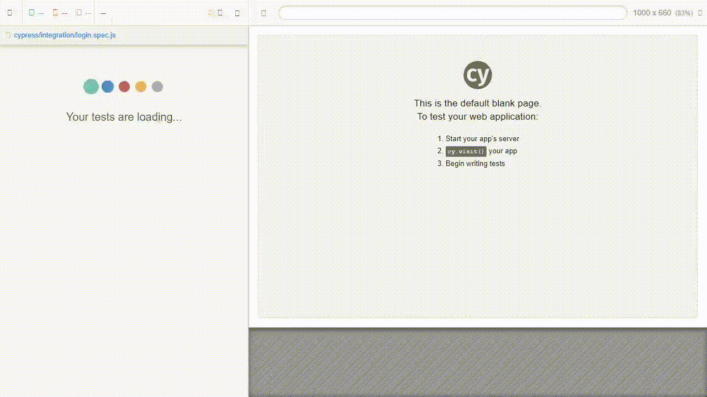

    
    <h1>Agilizei | Semana Agilizei 4.0</h1>

    

### :memo: Módulos

#### Os primeiros passos para dominar automação de testes
-[x] O que vamos aprender?
-[x] Cypress, o essencial de forma rápida
-[x] Preparação do ambiente
-[x] Estrutura Inicial
-[x] Executando comandos Cypress

### :hammer: Tecnologias
<ul>
    <li>Javascript</li>
    <li>Visual Studio Code</li>
    <li>Cypress</li>
</ul>
